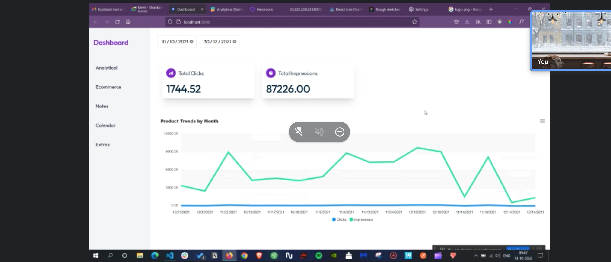

# Dropyacht's Principal Frontend Assessment

## Description

Your goal is to create a dashboard using ReactJS which shows Total Clicks and Impressions along with a functional line chart and gets updated based on the date range selected by the user. The data is provided in the `src/data/data.js` file or you can download the CSV [Here](https://raw.githubusercontent.com/sundi133/dy-pub-apis.github.io/main/test_data-ic.csv). Here's a screenshot of the dashboard you'll be building:

#### Requirements

- Total Clicks and Impressions to be calculated and updated whenever a valid date range is selected.
- The line graph should be updated with the correct values whenever a valid date range is selected.
- Left Navigation should be designed and it is OK for the links to be static.

**NOTE: We run plagarism checks off common open source libraries, and you will fail the test if you copy code.**

## Instructions

#### Setup

The project is bootstraped using create-react-app. Running `npm install` and `npm start` should start the dev version of the web-app. We have `typescript` already installed, so that can be leveraged during development. `src/App/components/Dashboard.tsx` will be a nice starting point to create layout for the dashboard but feel free to change the structure as you see fit.

#### Rules and tips

- You're allowed and encouraged to install helper libraries that can help you design things better. Feel free to add CSS styling to make the game visually appealing, we'd recommend using [TailwindCSS](https://tailwindcss.com/).
- Any type of React components are acceptable, but we'd prefer you use functional components with hooks.
- You're allowed to use the file structure of your choice, but we'll be looking for candidates to design clean and modular code
- You're allowed to use a state management tool of any kind, and persistence is not required.
- You're allowed to use any charting library of your choice, apexcharts, chartjs or others
- Add comments wherever necessary, and keep function names relevant for the reviewer to have a better understanding of how things work.
- If possible, update the README with a few thoughts on your approach and anything else you want your reviewer to know when reviewing your code.

Remember, this is an opportunity to showcase your skills and problem-solving abilities. We're looking for a principal level engineer who can turn an open-ended problem into an elegant solution. Good luck, and we look forward to seeing your implementation!
